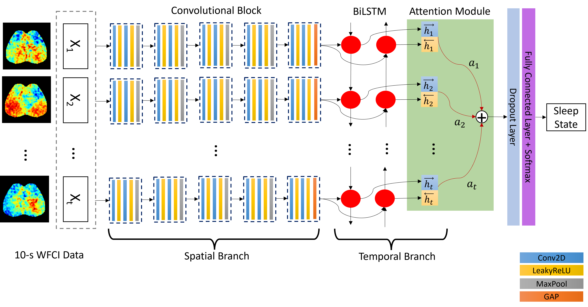

# Attention-Based CNN-BiLSTM for Sleep States Classification of Spatiotemporal Wide-Field Calcium Imaging Data
- Author:
  - Xiaohui Zhang (University of Illinois at Urbana-Champaign, xiaohui8@illinois.edu)
  - Eric C. Landsness (Washington University in St. Louis)
  - Jin-Moo Lee (Washington University in St. Louis)
  - Joseph P. Culver (Washington University in St. Louis)
  - Mark A. Anastasio (University of Illinois at Urbana-Champaign, maa@illinois.edu)  
## Introduction
The repository documented the code for implementing the attention-based bidirectional long short-term memory network to automatically classify sleep stages of spatial-temporal wide-field calcium imaging (WFCI) data. This is an extension of our previous work on applying multiplex visibility graph for automatic sleep stage classification of WFCI in order to achieve better interpretability of the model. The previous paper can be found [here](https://doi.org/10.1016/j.jneumeth.2021.109421).

## System Requirements
- Linux
- Miniconda >= 4.8.3
- Python 3.10.2. 
- Tensorflow 2.7.0.
- CUDA 11.7
- SciPy, NumPy, scikit-image, sklearn, matplotlib.
- [Focal loss package](https://github.com/artemmavrin/focal-loss).

The conda environment including all necessaray packages can be created using file `environment.yml` in the repository:
```
conda env create --file environment.yml
```
## Dataset
Part of the WFCI data used in this paper is available on PhysioNet. To note, If you're using our data, please cite:
```
@article{landsness2021wide,
  title={Wide-field calcium imaging sleep state database},
  author={Landsness, Eric and Zhang, Xiaohui and Chen, Wei and Miao, Hanyang and Tang, Michelle and Brier, Lindsey and Anastasio, Mark and Lee, Jin-Moo and Culver, Joseph},
  journal={PhysioNet},
  year={2021}
}
```
